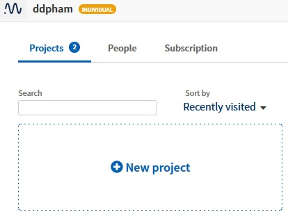
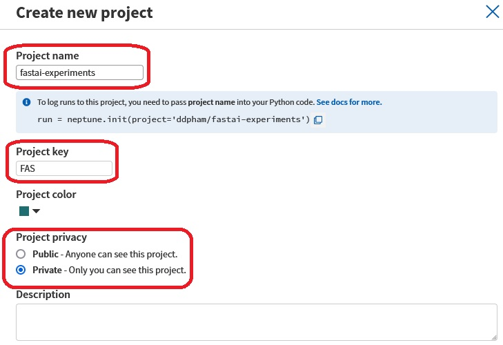
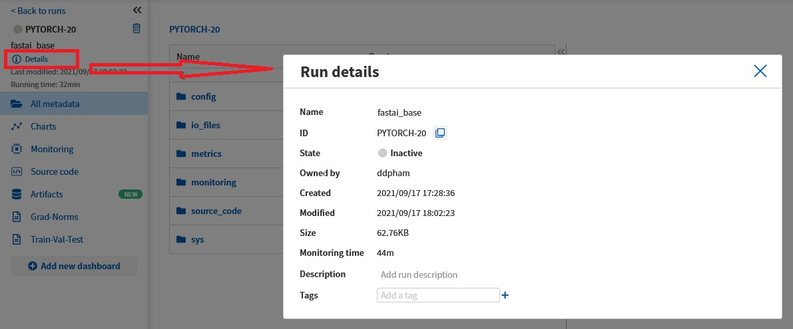
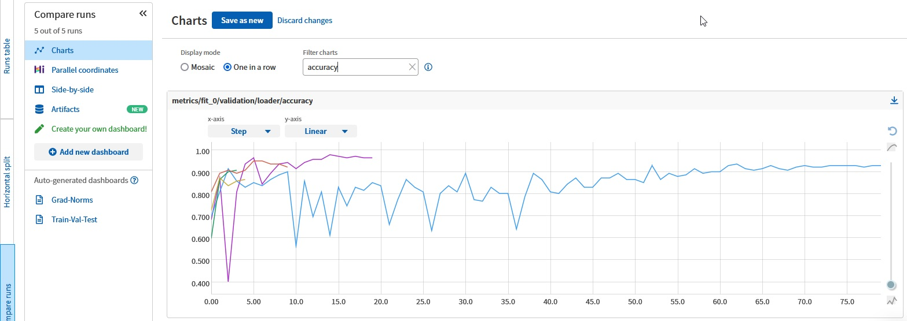
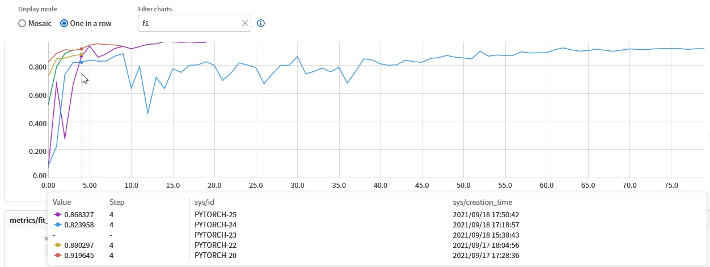
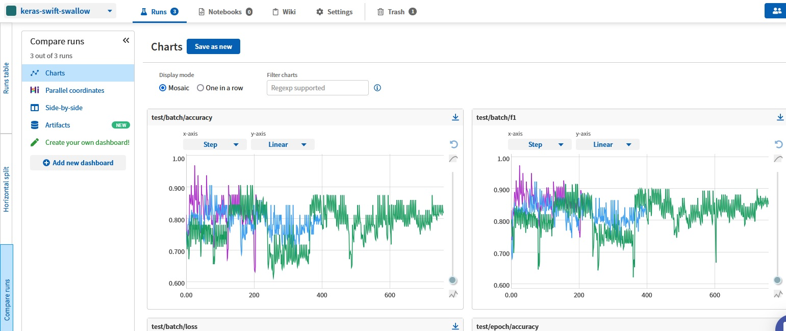

# neptune-experiments
experiments of neptune.ai on fastai and keras frameworks

# Tạo tài  khoản và project
> Trước khi bắt đầu với Weights & Biases, chúng ta cần tạo tài khoản và tạo project trên [https://neptune.ai](https://neptune.ai)
> 
> SignUp tài khoản.
> 
> Tạo 1 project mới:


> Sau đó tạo tên cho project:


Ở đây tôi đã tạo sẵn 2 project cho [fastai-experiments](https://app.neptune.ai/ddpham/fastai-swift-swallow) và [keras-experiments](https://app.neptune.ai/ddpham/keras-swift-swallow)


# Cách sử dụng
> Ở đây tôi chỉ đề cập đến 2 framework chính là `fastai` và `keras/tensorflow`. Neptune còn có với các framework khác như `scikit-learn`, `xgboost`, `lightgbm`, `pytorch`, `huggingface` và có cách log chung cho bất kỳ loại framework nào. Chi tiết xem ở đây [neptune-integrations](https://neptune.ai/integrations)


## fastai
Sau khi đã tạo xong project, trước khi bắt đầu các model, bạn sẽ cần khởi tạo việc log lại model thông qua phương pháp sau:

```python
from neptune.new.integrations.fastai import NeptuneCallback
import neptune.new as neptune

PROJECT_NAME = 'TÊN_PROJECT_CỦA_BẠN'
NAMESPACE = 'NAME_SPACE_BẠN_ĐĂNG_KÝ'

# Tạo run:
run = neptune.init(project=f'{NAMESPACE}/{PROJECT_NAME}')
```
Nếu bạn init lần đầu, neptune sẽ tự tạo cho bạn project, và run_id. Với mỗi run, bạn có thể log lại thông tin của model mà bạn mong muốn log lại.

Sau đó, bạn sẽ thấy màn hình của session (run) của bạn. Bạn có thể thay đổi  tên của session:




Với model của bạn, bạn có 2 cách để log model với `NeptuneCallback`:
1. Log với callback là của learner, như vậy toàn bộ các bước khi bạn thực hiện vs learner sẽ được log lại (bao gồm cả `lr_find` nếu bạn sử dụng):
```python
# Log với learner:
learner = cnn_learner(dls, resnet50, pretrained=True,
                      loss_func=CrossEntropyLossFlat(), 
                      metrics=[accuracy, F1Score()], 
                      cbs=[NeptuneCallback(run=run)])
```

2. Log với `fit`/`fit_one_cycle` của learner khi bạn bắt đầu train model:
```python
learner = cnn_learner(dls, resnet50, pretrained=True, loss_func=CrossEntropyLossFlat(), metrics=[accuracy, F1Score()])
lr_valley = learner.lr_find()
learner.fit_one_cycle(epochs=10, max_lr=lr_valley, cbs=[NeptuneCallback(run=run)])
```

Để kết thúc với session cả mình:
```python
run.stop()
```

Sau cùng, bạn có thể thấy kết quả ntn trên web



Chúng ta có thể dễ dàng so sánh kết quả các metrics giữa các model để đánh giá mức độ hiệu quả của chúng:



Bạn có thể xem chi tiết với [neptune-experiments-with-fastai.ipynb](https://github.com/ddpham/neptune-experiments/blob/main/nbs/neptune-experiments-with-fastai.ipynb)


Kết quả toàn bộ các model được log lại trên server của neptune, bạn có thể xem tại đây [neptune: fastai-swift-swallow](https://app.neptune.ai/ddpham/fastai-swift-swallow)

## keras
Tương tự như fastai, để tạo `run` cho neptune, chúng ta sử dụng phương pháp `init` như sau:

```python
from neptune.new.integrations.tensorflow_keras import NeptuneCallback
import neptune.new as neptune

PROJECT_NAME = 'TÊN_PROJECT_CỦA_BẠN'
NAMESPACE = 'NAME_SPACE_BẠN_ĐĂNG_KÝ'

# Tạo run:
run = neptune.init(project=f'{NAMESPACE}/{PROJECT_NAME}')
```

Tất nhiên bạn có thể sử dụng thêm argument config để config các hyperparameters mà bạn mong muốn theo cách của bạn (learning_rate, epochs...). Ở đây, mình ko đề cập đến config vì bản thân cần làm tương đối nhiều thứ chi tiết với các hyper parameters này mà chỉ muốn neptune log lại các giá trị này thôi.

Với keras, bạn bổ sung `NeptuneCallback()` vào `callbacks` khi `fit` là được:
```python
model.fit(train_ds, epochs=epochs, validation_data=valid_ds, callbacks=[NeptunebCallback(run=run)])
```

**Lưu ý**: Khác với fastai, chúng ta ko có thêm `SaveModelCallback()` để lưu lại model tốt nhất.

Khi đã chạy xong thử nghiệm với model nào, bạn cần stop run:
```python
run.stop()
```
Chỉ đơn giản có vậy thôi.
Kết quả bạn nhận được sẽ tương tự như sau:



Bạn có thể xem chi tiết với [neptune-experiments-with-keras.ipynb](https://github.com/ddpham/neptune-experiments/blob/main/nbs/neptune-experiments-with-keras.ipynb)

Kết quả toàn bộ các model được log lại trên server của neptune, bạn có thể xem tại đây [neptune: keras-swift-swallow](https://app.neptune.ai/ddpham/keras-swift-swallow)
